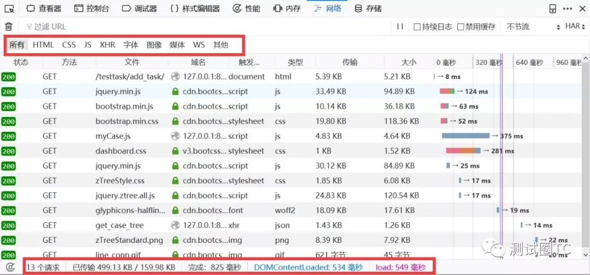

# learn-performance-class

## 基础篇幅

性能测试是一个很大的话题，在开始这个项目之前，我只是有个大体的框架，具体有哪些内容，一点点补充吧。

### 性能测试的分类

__最简单的分类__

__后端性能__

在微服务架构下， 后端性能其实就是接口性能。我们更多的时候不再设计模拟用户场景，而是针对单个或一组关联接口进行性能测试，这其实一定程度降低了测试的难度。

__Web 前端性能__

前端的运行有两种模式：

* 打包成静态资源文件，通过Nginx配置静态资源目录，直接访问。
* 前端启动服务，动态运行。

前端的服务非常复杂，一些数据类的，一般通过调用后端端口返回数据，剩下的`css`、`javascript`、`图片`、`音视频`等资源一般会通过单独的CDN服务器获取，最后就是自身的HTML文件了。

__App 性能__

app性能主要考察的是手机本身的性能，包括cpu、内存、存储等。当然，一般app会涉及到与服务端数据的交互，同样会涉及到后端性能。

### 后端性能测试类型

经常会听别人说到`性能测试`、`负载测试`、`压力测试`、`并发测试`，`基准测试`等。这些概念除了非专业人员分不清楚，甚至许多专业测试人员也对这些名词的理解也很模糊，甚至经常混用。

__性能测试 (Performance Testing)__

性能测试的概念最早源自计算机系统的开发，它的主要目标是评估软件在特定工作负载下的表现。

是一个广义的概念，涵盖所有与系统性能相关的测试，包括响应时间、吞吐量、并发处理等。

* 目标：

在一定负载下，观察系统的性能表现，以确定是否满足生产要求。

* 关注点：

通常包括响应时间、吞吐量、资源利用率（如 CPU、内存、磁盘 I/O 等），数据传输速率、并发用户数、事务处理能力等性能指标是否符合要求。

* 应用场景：

通常用于了解系统在高负载场景下的性能，确定系统在特定用户数或请求量下的性能表现。适用于各种场景的性能评估。

* 示例：

在性能测试中，测试人员可能会检查一个电商网站在有1000名用户同时在线浏览时的页面加载速度是否在 2 秒以内。

__负载测试 (Load Testing)__

负载测试是性能测试的一种特定类型，它通常与大型服务器、数据库和网络相关，旨在模拟实际使用场景。

专注于在正常和高负载下的性能表现，通过逐步增加用户数或事务数，观察系统的响应。

* 目标：

验证系统在不同的负载（例如并发用户数或事务数）下的表现，测试系统能否在预期的负载范围内正常运行。

* 关注点：

系统在逐步增加负载时，性能是否保持稳定，以及在某一负载下性能是否开始下降。

* 应用场景：

这种方法目的是了解系统在高负载场景下的性能，确定系统在特定用户数或请求量下的表现。

* 示例：

测试一个系统在同时有 500、1000 和 5000 名用户访问时，系统的响应时间、吞吐量、错误率等指标如何变化。

__压力测试 (Stress Testing)__

压力测试源于硬件测试，用于测试系统在极限条件下的稳定性，后来被引入到软件测试中。

压力测试用于测试系统在超出设计负载的情况下的表现，目的是确定系统的崩溃点。

* 目标：

是检测系统的极限性能，找到系统的最大承载能力和失效点，并确保在故障发生时系统能够正确恢复。

* 关注点：
系统在负载过大时的表现，是否会崩溃，崩溃后的恢复能力如何。

* 应用场景：

用于检测系统的极限性能，找到系统的最大承载能力和失效点，并确保在故障发生时系统能够正确恢复。

* 示例：

测试一个电商平台的支付系统，突然有 10 万用户同时发起支付请求，观察系统是否会崩溃及其崩溃后的恢复机制。

__并发测试 (Concurrency Testing)__

并发测试源于数据库和多线程编程，主要用于测试多个用户或线程同时操作共享资源时的系统表现

* 目标

并发测试模拟多个用户或进程在同一时间段内访问和操作同一系统或资源，测试系统的并发处理能力。

* 关注点

资源锁定、死锁、数据冲突等问题。

* 应用场景：

特别适用于需要处理高并发访问的系统，如银行交易系统、在线游戏服务器等。

* 示例

测试一个多人在线协作的编辑工具，多个用户同时编辑同一文档，查看是否会导致数据不一致或系统响应延迟。

__基准测试 (Benchmark Testing)__

基准测试属于性能测试的一种，用于评估和衡量软件的性能指标。我们可以在软件开发的某个阶段通过基准测试建立一个已知的性能水平，称为`基准线`。当系统的软硬件环境发生变化之后再进行一次基准测试以确定那些变化对性能的影响。这是基准测试最常见的用途。

* 目标

通过与行业标准或历史数据进行对比，衡量系统的性能，确定其在某种工作负载下的表现。更多的是`一种对比分析`。

* 关注点：

比较不同环境下的系统性能，例如在不同硬件配置、数据库或操作系统环境中的表现。

* 应用场景：

用于确定系统在标准条件下的性能表现，通常作为性能基线，便于在后续测试中作为一个参考标准，帮助判断系统是否达到了预期的性能目标。

* 示例：

测试某个数据库管理系统的查询速度，并与其他同类产品进行对比，或者在不同版本之间进行对比。

__总结__

我们在进行性能测试的时候往往是综合的，既要逐步增加并发用户数据 - `负载测试`，又要关注测试的系统指标 - `性能测试`，还要验证数据的最大并发能力 - `压力测试`，最后还要将测试结果作为基准线 - `基准测试`。

不过，我们开展性能测试工作前，一定要明确性能测试的目标，在一次性能测试中，加载太多的目标，往往会让测试工作变得过于复杂，从而也缺乏侧重点，最终得到的结果也不一定准确。

### 性能需求分析

1、客户方提出

客户方能提出明确的性能需求，说明对方很重视性能测试，这样的企业一般是金融、电信、银行、医疗器械等；他们一般对系统的性能要求非常高，对性能也非常了解。提出需求也比较明确。

> 有时候也会遇到客户提处不合理的需求，例如：只有2000人使用的OA系统，要求并发用户2000，结合使用场景分析，显然是不合理的。注册用户数 和并发用户数是两个概念。

2、根据历史数据分析

对于一些面向用户的独立产品，比较难定位市场的大小，可以先上线运营一段时间，通过运营可以搜集客户资料，比如，每月、每星期、每天的峰值业务量是多少。用户以什么样的速度在增长。用户对系统的哪些功能模块使用的最多，他们所占的比例等等。

收集到这些数据之后，我们就可评估系统的系统需求指标，以及接下来的扩容目标，从而进行性能测试。

3、需求分析与定位

这里根据前期的需求分析与定位，来分析确定系统性能指标。例如某省幼儿园管理系统。统计全省有多少家幼儿园，幼儿园的人数，系统的使用时间段等。经过与需求人员交流分析也能得到比较明确的性能指标。

4、参考历史项目或其它同行业的项目

如果公司之前有类似的项目经验，根据项目大小及上次性能测试的一些指标。从根据项目的规模可以制定出相应的性能指标。

即使本公司没有类似的项目，但其它公司有类似的项目，例如，电商系统，可以找竞品，同等规模，或大于自己的产品，进行借鉴分析。——虽然不能完全照搬数据，但是可以通过其他行业成熟的需求来了解需要测试的项目有哪些，应该考虑到的情况有哪些种。 

**性能需求描述遵循原则**

性能测试需求的描述需要遵循一些基本原则，以确保测试的准确性和有效性。您提到的准确性、一致性和特定性是非常重要的方面，但还可以进一步补充和完善。以下是对这些原则的更正和补充：

1. 明确性（Specificity）：
   - 性能测试需求应具体明确，避免模糊不清的表述。
   - 明确指出测试的目的、范围、预期结果和关键性能指标（KPIs）。

2. 准确性（Accuracy）：
   - 性能测试数据应准确无误，测试方法和工具的选择应确保结果的精确性。
   - 避免因测试环境、数据或配置不当而导致的误差。

3. 一致性（Consistency）：
   - 性能测试应在相同或相似的条件下进行，以确保结果的可比性。
   - 测试方法和标准应保持一致，避免在不同测试轮次中引入不必要的变量。

4. 可重复性（Reproducibility）：
   - 性能测试应能够重复进行，以便验证结果的稳定性和可靠性。
   - 测试环境和条件应详细记录，以便其他测试人员能够重现测试过程。

5. 可衡量性（Measurability）：
   - 性能测试需求应明确关键性能指标（如响应时间、吞吐量、资源利用率等）的衡量方法和标准。
   - 确保测试能够量化地评估系统的性能表现。

6. 相关性（Relevance）：
   - 性能测试需求应与用户的实际使用场景和业务需求紧密相关。
   - 测试应模拟用户在实际操作中可能遇到的各种情况，以评估系统的真实性能。

7. 可行性（Feasibility）：
   - 性能测试需求应在技术、资源和时间等方面具有可行性。
   - 避免提出过于复杂或难以实现的测试需求。

8. 文档化（Documentation）：
   - 性能测试需求应详细记录并归档，以便后续测试人员参考和遵循。
   - 文档应包括测试目的、范围、方法、预期结果、关键性能指标和测试环境等信息。
