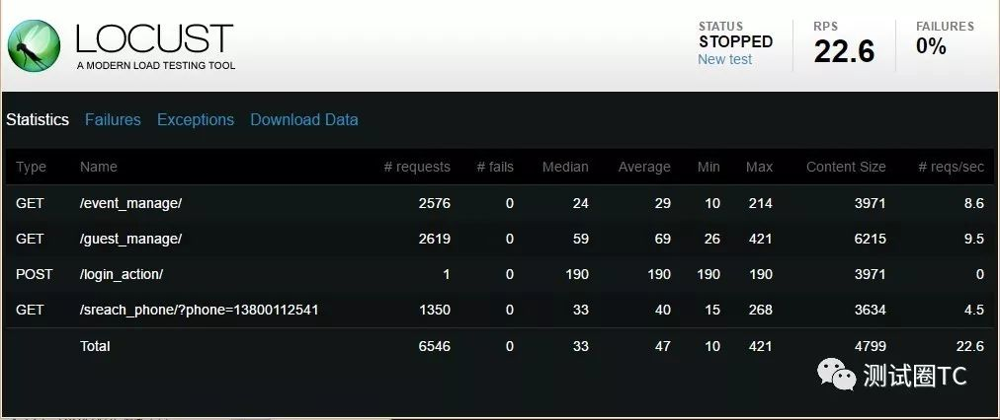

# learn-performance-class

## 基础篇幅

性能测试是一个很大的话题，在开始这个项目之前，我只是有个大体的框架，具体有哪些内容，一点点补充吧。

### 性能测试的分类

__最简单的分类__

__后端性能__

在微服务架构下， 后端性能其实就是接口性能。我们更多的时候不再设计模拟用户场景，而是针对单个或一组关联接口进行性能测试，这其实一定程度降低了测试的难度。

__Web 前端性能__

前端的运行有两种模式：

* 打包成静态资源文件，通过Nginx配置静态资源目录，直接访问。
* 前端启动服务，动态运行。

前端的服务非常复杂，一些数据类的，一般通过调用后端端口返回数据，剩下的`css`、`javascript`、`图片`、`音视频`等资源一般会通过单独的CDN服务器获取，最后就是自身的HTML文件了。

__App 性能__

app性能主要考察的是手机本身的性能，包括cpu、内存、存储等。当然，一般app会涉及到与服务端数据的交互，同样会涉及到后端性能。

